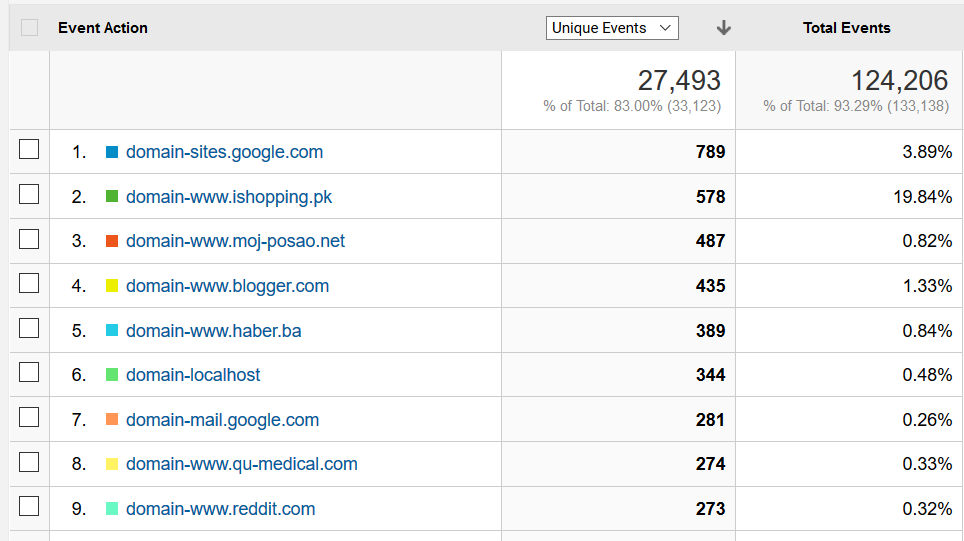

# Find & Replace Extension for Text Editing
RegEx Search & Replace Extension for Chrome and Firefox browsers.

**Project Website:** https://find-and-replace-f6588.firebaseapp.com/

**Chrome Web Store Link:** https://chrome.google.com/webstore/detail/find-replace-for-text-edi/jajhdmnpiocpbpnlpejbgmpijgmoknnl

**Firefox Add-ons Store Link:** https://addons.mozilla.org/en-US/firefox/addon/find-replace-for-text-editing/

**Dissertation Report (Project Documentation):** [dissertation/dissertation.pdf](dissertation/dissertation.pdf)

## Project Specification (TODO -> convert to dissertation report)

## Development

### Accessibility
(todo: look at https://developer.chrome.com/extensions/a11y)

#### Keyboard
Launch the toolbar: `Ctrl+Shift+F` (`Command+Shift+F` on Mac)
Note that all `Ctrl+F`, `Ctrl+R`, and `Ctrl+Shift+R` are already predefined browser shortcuts, so we cannot use those.

Once the search widget appears:
  - Next match: `Enter` in *Find* input field
  - Previous match: `Shift+Enter` in *Find* input field
  - Replace: `Enter` in *Replace* input field
  - Replace All: `Shift+Enter` in *Replace* input field

When user jumps between occurrences we also want to keep the text in screen viewport and we therefore always check the current element position and scroll the window accordingly in case it is out of view.

#### Context Menu
User can select text on the page and, after right-clicking the selection, search for the text using the extension. This should open the extension search widget and/or replace the current 'Find' input field with the selected text.

UPDATE: The background page cannot open the pop-up(https://stackoverflow.com/questions/5544256/chrome-extensionhow-to-pragmatically-open-the-popup-window-from-background-htm). It cannot be opened programmatically - the user must click on the browser action or press the keyboard shortcut to open it. But we can inject a content script that creates a floating div in the page with a hint text suggesting the user should press the keyboard shortcut to open the find & replace widget.

#### Widget Design
At the same time, we initially disable the action buttons when the user hasn't typed in anything into the search field yet. This is in order to draw attention to the active input field element, rather than overwhelming the user with options that cannot be used. Google Docs use the exact same design pattern.

#### Content Script Target Glow Design
We add a box shadow highlight to the currently selected input area. If no single text area is selected, we higlight all text areas in the page. We do this to indicate which text is going to be affected by the search and replace operation and thus improve usability. Without the visual indicator people might complain that the extension doesn't work, while in fact they might just have a different text area selected. The search widget will also indicate if there are no editable text areas in the page.

### API Design
There should be an extension background page with a content script that is programmatically injected into the page whenever the user triggers 'find & replace'.

TODO: Explain security scopes, TODO: Explain permissions set in manifest and motivation behind the `activeTab` permission https://developer.chrome.com/extensions/activeTab#motivation  (we are not requesting chrome.tabs permission)

Instead of searching for a one text occurrence at a time, we want to match the behaviour of modern text editors and show the user all matches at once using text highlighting. We therefore only perform the search once (meaning everytime search parameters change), because later actions (find next/prev, replace one/all) will simply work with the text occurrences we already found. 

#### Component Lifecycle
Our background page is only a single JavaScript file that sets up all required events and starts listening to incoming message connections. Whenever the extension icon is clicked (or the launch keyboard shortcut pressed), our UI widget pops up. The widget can be closed/destroyed by the user anytime, so it first registers itself with our background page, so that the background page can see when the message port disconnects (when the widget is closed). 

The widget needs to communicate with the content script to manage highlighting in the page. Right after the widget connects to the background page, the background page checks if the content scripts have been injected already (the widget may have been previously closed and reopened). If they have not been injected yet, it injects them. If, on the other hand, they have been injected previously, it simply sends a message to the content script to reconnect (restart its port connection). 

How does the background page check if the content scripts have been previously injected for a given tab? One solution I considered was storing tab IDs and checking a given tab ID against our stored list of IDs to decide if the content scripts are already injected in this tab. This approach might be buggy when we move tabs between more than one browser windows and is also not very efficient.

Instead, to check if our content scripts have been injected, I came up with a different approach. I created a new very simple content script, that gets injected into the page first before anything else, and simply detects the presence of the code directly in the page (it executes in the same sandboxed namespace so we can check for existence of our JavaScript variables) and returns this boolean result to the background page, which acts accordingly.

Once our main content scripts are injected, they broadcast a port connection - both the background page and UI widget are listening for this event. Background page needs to connect to the content script to see when the message port disconnects (user may have navigated to a different page and we thus lost the injected code). Search widget needs the content script connection for all its API actions - this is going to be the most frequent message passing channel.

##### Why is the lifecycle complicated
We are managing three separate component - the search widget, the background page, and the context of the webpage itself (via content scripts). None of these components are permanent - The search widget can be destroyed/closed anytime. The content scripts in the page are lost whenever the user navigates to a different website. And finally the background page isn't persistent either - it simply sets up a bunch of event listeners that can wake it up in the future, and shuts itself down. (todo: https://developer.chrome.com/extensions/event_pages)

Could we do everything in the content scripts? Content scripts run in the content of the webpage and for security reasons they don't have access to the Chrome APIs - for a large portion of the extension functionality, and for the search widget integration, we need the background page.

##### Storing State
TODO:  
In Widget - Search params, all inputs;  
In Content Script: Refs to all DOM textarea elements, Find-next number (because it keeps dynamically changing and search widget should only receive it from content script messages passed to it)
In Background: Nothing - here we just set up events

TODO: Explain chrome.storage https://developer.chrome.com/extensions/storage and describe challenges faced when syncing state within the app - abstracting with Promises and chaining async operations once finished + observer pattern - subscribing to updates when another part of the app changes storage

#### User actions
- Update search query or options
  - 'Find' input field content changes
  - One of the search options is toggled
- Find next/previous
- Replace current/all
- Close the widget
- Click one of the panel buttons
  - Show Favourites
  - Show History
  - Show Templates
  - Show Help/Info

#### Actions API
User actions specified above directly translate to types of messages that need to be passed between our widget and the content scripts in the page. We define the following API, where each message has the prototype `{ action: string, data: Object }` where `data` is optional:

**action: shutdown**
- Clean up all active highlights when widget is closed

**action: restart**
- Trigger port reconnect action, on widget re-open

**action: log**
- Logs `data`

**action: updateSearch**
- Uses `data` to update search parameters
- Returns: `{ invalidRegex: boolean, invalidSelection: boolean, searchIndex: number, searchCount: number, currentMatch: object }`

**action: findNext**
- Finds next match
- Returns: `{ searchIndex: number, searchCount: number, currentMatch: object }`

**action: findPrev**
- Find previous match
- Returns: `{ searchIndex: number, searchCount: number, currentMatch: object }`

**action: replaceCurrent**
- Replaces current match with `data` contents
- Returns: `{ searchIndex: number, searchCount: number, currentMatch: object }`

**action: replaceAll**
- Replaces all matches with `data` contents
- Returns: `{ searchIndex: number, searchCount: number, currentMatch: object }`

**action: insertTemplate**
- Inserts template text `data` at current cursor
- Returns: `{ noCursorPosition: boolean }`

Object `currentMatch` is used to display advanced regex information about matched regex groups. It has the following structure: `{ groups: Array<string>, replace: string }`

### RegEx Search
JavaScript contains native support for regular expressions (https://developer.mozilla.org/en-US/docs/Web/JavaScript/Guide/Regular_Expressions). Without using any additional libraries, we can simply create new RegExp objects and execute search methods on regular strings to find matches for the given regular expression query.

When choosing the string that we want to search in, we need to only consider the text content in our HTML nodes - finding matches in `innerHTML` would be a mistake since we need to ignore the website's source markup and only consider the text that users see.  

#### Highlighting Found Matches

##### Highlighting in `contenteditable`
Highlighting inside a `contenteditable` element should not be a problem - we can simply inject our own `span` element with our custom class into the element's DOM. Contenteditable elements are designed to contain any HTML nodes so no problem here.

For the highlighting, I'm going to use the [mark.js](https://markjs.io/) plugin. We could certainly implement the highlighting ourselves (wrapping each search occurrence in `` elements with custom styling), but there are many tricky cases that we need to handle. For instance, HTML `
John <b>Smith</b>
` matches the query `John S` but simply inserting a `` at the start and end would violate HTML rules, and instead we'd need to create two pairs of `` elements - for `John ` and another for `S` inside the `<b>` tags.

There are more tricky cases like this. Therefore, it's wiser not trying to reinvent the wheel and instead use a plugin that is actively maintained and used by many people.

##### Highlighting in `<textarea>`
Highlighting text in `<textarea>` is more tricky because it only allows plain text to be displayed inside it. Any styled markup will not render as expected. To overcome this, one must create an overlay that exactly matches the textarea element and then highlight text in this new element. Further, there are many browser-specific quirks and one must also take care of synchronizing scrolling and handling textareas that are resizable by the user. In other words, it is a lot of work.  
http://codersblock.com/blog/highlight-text-inside-a-textarea/

Fortunately, there have been a few attempts to implement this. The most successful version I found was the following jQuery plugin: https://github.com/lonekorean/highlight-within-textarea/ becase it also supports resizable textareas (other plugins I found did not).  
Even though this plugin does better than all the other plugins that exist, it still has many issues, particularly when it comes to transferring all necessary CSS styles. When I was testing it, it failed to properly align text for several textareas with particular styling. Therefore, I contributed to the development of this open-source plugin by fixing all the bugs I found and creating a pull-request on GitHub.  
https://github.com/lonekorean/highlight-within-textarea/pull/19
  - Submitted: Sep 24
  - Reviewed by the author: Sep 25
  - Review comments addressed: Sep 25
  - After 2nd review the discussion still continues, there are backward-compatibility issues and conflicting views on the design and purpose of the plugin. As I'm injecting the code dynamically I have a slightly different use case and might need to leave my forked version unmerged.

For highlighting text in the `
` mirroring our textarea, I'll use **mark.js** again. This is mostly for making things consistent and having a single unified function interface (finding and replacing the plaintext separately would also be an option, but we are using the library already so there's no need to make things more complicated).

#### RegExp Replace
In the replace input string, user can specify special symbols to refer to the found occurrence.

- `$n` - Where n is a positive integer, inserts the n-th parenthesized submatch string.
- `$0` or `$&` - Inserts the matched substring.

These are commonly used to extend find & replace functionality in advanced text editors. Inspiratio also taken from Mozilla's spec on MDN website: https://developer.mozilla.org/en-US/docs/Web/JavaScript/Reference/Global_Objects/String/replace#Specifying_a_string_as_a_parameter

### Handling iframes
TODO: explain recursive search for active element

TODO: explain the concept of my Context object - performing all dom operations (in particular jQuery functions) with respect to a specific Window and Document objects (such as window.getActiveSelection, window.scroll etc.)

### Google Analytics

#### Implementing Google Analytics
The standard way of implementing Google Analytics is by inserting a short script into a web page, which then pulls more JavaScript code from Analytics servers, to collect user data, as well provide a developer interface to send additional tracking events.

This method will not work in Mozilla Firefox extensions due to their review policies (https://blog.mozilla.org/addons/2016/05/31/using-google-analytics-in-extensions/ - *The most popular way to do this is to inject the Google Analytics script into your codebase as if it were a web page. However, this is incompatible with our review policies. Injecting remote scripts into privileged code – or even content – is very dangerous and it’s not allowed.*).

As a workaround we need to use Google Analytics' Measurement Protocol (https://developers.google.com/analytics/devguides/collection/protocol/v1/), which is a simple API that accepts HTTP requests with analytics data. It collects data (and aggregates it for displaying dashboards and statistics via the same Analytics web interface) without relying on the Google Analytics JavaScript library running on the client, so we are essentially asked to implement the library ourselves and only send requests in the appropriate format to this API.

TODO: Explain how session is measured: https://support.google.com/analytics/answer/2731565 - 30 minute inactivity is a reasonable measure

#### General Tracking
I am going to embed the Google Analytics code into our extension's widget, so that we can track how many times users open the search widget, as well as how many unique users we have, and what kind of population they represent (along with additional user details).

##### Pageview Tracking
Our search widget is essentially a single page application, but we would like to track how many times users open different widget tabs (history, templates, etc.). So we send a `pageview` event every time a user opens a tab, and set the pageview path to the name of the tab. That way we can look at opening tabs as an actual page navigation. Suggestions taken from https://developers.google.com/analytics/devguides/collection/gtagjs/single-page-applications.

#### Event Tracking
In addition to the basic user and page view tracking we would like to know how users interact with our extension and in particular, if they use certain functionality significantly less/more. This might suggest potential ways we can improve our extension - for instance, if nobody ever uses the templates panel, perhaps we need to educate users on how to use it more effectively, or perhaps reconsider its overall usability.

##### Events
- Analytics enabled/disabled clicked - If the user has allowed Analytics to be used for a week and then opts-out, we want to know they did it (rather than thinking they stopped using the extension)
- Added to/Removed from Favourites - We can get more insight by looking at how often users use the star button. If they've never used it, perhaps it's not intuitive enough.
- New Template Created - Enables us to see how often users create new templates. If the numbers are very low, perhaps they don't know how to use this feature.
- Template Successfully Pasted - Enables us to see how many users have successfully inserted a template into a web page and thus how many know how to use them.
- Advanced Search enabled/disabled - We would like to know how often users use the advanced search functionality (regex search and in-selection search)

In the Google Analytics Dashboard we can plot how many of the total number of users triggered that given event in a given time period:

###### Domain Tracking
A lot of the feedback messages that are submitted after someone uninstalls the extension are not very useful and often look something like 'not working'. This is not very helpful as it doesn't tell me on which sites they tried to run it that didn't work for them. The analytics that I have been collecting so far give me insight into which features of the extension are more used than others but tell me nothing about the sites where the extension is actually used.

To get a better idea of which sites are the most frequently used and which should therefore receive more attention (to make sure everything works as expected), we would like to anonymously collect domain names (not URLs, only host names, for privacy issues). This would allow us to construct a list of the top domain names where the extension is used most frequently, and this could also help us with user acquisition and targeted marketing in the future. We therefore add a Google Analytics event that reports the domain name whenever the extension is used. We can then combine unique events from each user to create the list.

*Top domains after 2 weeks of reports. 13th January 2018*

### Testing
How can we test our extension? The Chrome Extension Guides contain a section on debugging (https://developer.chrome.com/extensions/tut_debugging) but do not mention any extension testing methods.

For testing web applications in general we have several kinds of tests (Sources: https://medium.com/powtoon-engineering/a-complete-guide-to-testing-javascript-in-2017-a217b4cd5a2a): 
  - Unit Tests - testing individual functions
  - Integration Tests - testing several modules working together
  - Functional Tests - testing a scenario on the whole product (in-browser interaction)

#### Unit Tests
Our content script contains a lot of individual functions that we can test separately. I'm going to use [Mocha.js](https://mochajs.org/) for unit testing of individual methods in the content script and search widget. The coverage will be very limited however, because most functions need to interact with the Document and Window objects, which are supplied by the web browser and will be undefined when running a command line test. We therefore shift our main focus to integration tests and functional tests.

#### Integration Tests
We would like to test if multiple modules or parts of our code can work well together. We split this into tests for the search widget, and tests for the content script. Testing the extension working as a whole will be addressed in the Functional Tests section.

##### Search Widget Tests
Our UI search widget is mostly focusing on keeping the state of UI consistent. Here we are more interested in the widget being rendered correctly as a whole, and that the UI doesn't accidentally change in unexpected ways. Because of the way we separated the search widget development (described earlier), we could simply mount our React root on a standard website DOM and test basic user interaction. There will be no content script for it to communicate with, but this is not the focus at this point.

Because the search widget code is written using React, we can use React's testing tool called Jest, which makes it very easy to test React components. It is using a specifically designed test renderer that instead of spinning up an actual browser instance to render a visual component, it creates a snapshot of the resulting HTML and writes it into a file. These snapshots are regenerated on subsequent test runs and compared to the old versions. That way it can quickly discover and report any changes (and mark that particular test as failed in such case).

Also see [Jest Snapshot Testing](https://facebook.github.io/jest/docs/en/snapshot-testing.html)

##### Content Script Tests
What we are interested here is, given a simple website, can the injected functions from our content script work together, so that when triggered by a mocked API call, they successfully perform the find operation and highlight occurrences.

We do this by creating a simple HTML page that already includes all the code that the extension normally injects into a web page. In addition to that, we include one more script file that contains the actual test suite.

Unfortunately, the content-script hides its scope in an isolated JavaScript sandbox, so simply including it in a local HTML page will not allow us to interact with it in any way, because the connection API that it uses is only made available to the script when it is injected via an extension. We therefore need to detect when the content script is running in the debug mode and not as a part of an installed extension (the state when the runtime connection API is undefined is a good indicator of that) and we expose the API message handling function when this is the case.

[Content Script Testing Demo - YouTube link](https://www.youtube.com/watch?v=_SzxjBO75mE)

#### Functional Tests
To implement functional tests, we would need to drive a browser that installs our extension and interacts with it. There is a tool called [PhantomJS](http://phantomjs.org/) which is commonly used for headless WebKit testing. Unfortunately, it is not based on Chromium, so we cannot load Chrome extensions (https://stackoverflow.com/a/23643111).

To be able to install and test the extension as a whole in Chrome and Firefox, we are going to use [Selenium](http://www.seleniumhq.org/), which is a browser automation tool that can directly control a browser instance and allows us to install browser extensions as a part of the testing process https://stackoverflow.com/questions/15005833/browser-plugin-testing-with-selenium/17117849).

We are going to install Selenium WebDriver to control Chrome and Firefox browsers. The Selenium WebDriver accepts commands via a client API and sends them to a browser (https://en.wikipedia.org/wiki/Selenium_(software)#Selenium_WebDriver). The client API has several implementations in various programming languages. I decided to use JavaScript to keep my whole codebase consistent. 

The Selenium project have their own JavaScript implementation for the client API, but after comparing it to alternatives, I decided to use [WebDriver.IO](http://webdriver.io/), which is another JavaScript implementation of the (Selenium 2.0) WebDriver API, but it has much simpler and more readable syntax (https://github.com/webdriverio/webdriverio#syntax-example).

##### Sites that need test coverage
The following sites have been tested manually so far and it would be great if we could automate their testing.

- Gmail
- Blogger
- WordPress
- Reddit
- Stack Overflow
- Google Groups
- LinkedIn (article editor)

##### Setting up Selenium tests
I successfully updated our configuration to install our extension once an automated browser instance is launched. It correctly opens a new tab with the Help text (our User guide). First functional test that I created tests that this actually happens (new tab opened on install with the extension user guide).

Unfortunately the Selenium driver do not allow direct mouse interactions with the extension - there is no way to launch it from the toolbar (Mentioned here: https://releasematic.wordpress.com/2013/12/29/automation-testing-chrome-extensions/ and here: https://github.com/webdriverio/webdriverio/issues/2108). At the same time, I designed the extension with the minimal set of permission, and so the extension doesn't execute any code and doesn't inject anything into to page unless the user launches the widget first.

The only thing we can do is open the extension's HTML page directly. So due to API limitations we won't be able to set up tests for the specific sites listed above. The only way we could test the highlighting for these sites would be to create a new extension that forces the injection of the content script code in every page the browser visits and also automatically starts sending the exact data payloads mocking the API coming from the (never running) search widget. Besides it being loads of work to implement, this would not actually be the full functional tests that we were aiming for - it would be testing the content script alone but none of the actual component interaction and communication with the search widget. We abandon this idea, because for the sole purpose of testing of the content script functionality we can find an easier and more efficient way to test things. We addressed this in the Integration Tests section.

#### Manual Tests
Due to some of the limitations mentioned above and also to speed up initial development of the core functionality. I created a demo HTML page that contains all possible combinations of editable text areas - all types (plain textarea, contenteditable, and single-line inputs), all sorts of styling, various states such as with a scrollbar, or in a scrollable container, as well as text areas inside nested iframes, and various other combinations.

It is very quick to open this HTML page in a browser and use the already installed extension to see if everything is working as expected. It also allows for efficient debugging, and focusing on a specific element category when things don't work.

### Sites currently known to be broken
- Facebook - highlighting and replace works but is reverted to original onClick
- Quora - inserting `<mark>` violates their `` format and scatters original text (inserts newlines)
- Sites using the CodeMirror plugin, including Jupyter Notebook on localhost
- Google Docs

#### Why is it broken
Facebook, Quora, and several other sites use contenteditables and keep the text content separately in JavaScript variables. When I insert my markup, and replace text, their JavaScript immediately restores the previous state (switches back to the orginal text). When I detach their JavaScript listeners by cloning the contenteditable DOM node, I am able to highlight and replace text successfully and the user can continue editing, but when they click the post or submit button, all changes made after the last search & replace operation was made are lost. This is because the text that is posted is the content of their JavaScript variables, and not the current contenteditable content.

#### How to fix broken sites:
There would need to be an alternative way of adding/changing the editable text (besides directly changing textContent/innerHTML/innerText). Sending keyboard events does not seem to work.

1. Help sought on Stack Overflow: https://stackoverflow.com/questions/46981226/edit-text-in-facebook-messenger-contenteditable-div?noredirect=1#comment80915743_46981226
2. Marked as off-topic - but someone commented with a possible hint in time
	- Potential fix: *Focus the editor element and use document.execCommand in 'insertText' or 'insertHTML' mode.*
3. Discovered `document.execCommand()` API https://developer.mozilla.org/en-US/docs/Web/API/Document/execCommand

#### Product Development Iteration with `document.execCommand()`
TODO: Explain the API, that it originated from IE, but now is part of W3C spec (+add link)

After switching to `execCommand` for manipulating `contenteditable` suddenly insertion started working on Facebook:
- It fixed template insertion in Facebook contenteditable

However, for replacement (where the original content must be deleted first) it proved very unreliable, because `execCommand` operates on the active cursor selection, which can be programmatically set by manipulating the `Selection` object, but since there's no way to tell it to select only the text content itself it ended up deleting whole DOM tags and even after a lot of testing it wasn't reliably able to replace parts of text in a post and pass through all the automatic DOM manipulation that Facebook implements. Therefore, we disable the extension on Facebook and Messenger for now.

LinkedIn: All inserted content and tags are filtered so we cannot insert `<mark>`s or ``s. We check which tags are allowed - `
`, `<strong>`, `<em>`, `<u>`, so we can use the underline (`<u>`) instead of `<mark>`. Solved.

#### How to fix CodeMirror (and thus Jupyter Notebook)
CodeMirror is using hidden textareas for input from the user and then they are shadowing this in a formatted DOM that is displayed to the user. This is how CodeMirror 2 is implemented, the previous version was using contenteditable and Document design mode to display formatted text, but this turned out to be very inconsistent across browsers, and buggy in general (See http://codemirror.net/1/story.html and http://codemirror.net/doc/internals.html).

If we had a single mirrored textarea, our extension would work just fine. However, CodeMirror has been around for several years and the current 5th version implements things differently (http://codemirror.net). After the plugin is initialized it waits for the user to click somewhere in the editable area, which is in fact non-editable DOM, that adds a virtual cursor animation to appear as one. It then spawns an empty textarea in that section of a line and waits for the user's keyboard input. This small textarea is immediately cleared and reset when the plugin area loses focus or when the user selects a different line (or in fact any mouse click), with the typed content being commited into the non-editable DOM to visually reflect changes.

This behaviour prevents our extension from working because there is no content in the spawned textarea, and it doesn't have access to the non-editable DOM that is displayed (because we limit our extension to editable text areas, rather than consider any HTML). Therefore fixing CodeMirror (and thus all sites using it, including Jupyter Notebook) would mean implementing find & replace for any HTML - something that we decided not to do in the initial software specification.

### Feedback & Iteration

#### Changelog (releases)
- v1.3.9 - 14th Jan - Support local debug mode for testing
- v1.3.8 - 14th Jan - Fix 'No Target' indicator
- v1.3.7 - 13th Jan - Add Google Docs warning notification
- v1.3.6 - 2nd Jan - Add support for single-line input fields
- v1.3.5 - 31st Dec - Add hostname to GA for domain analysis
- v1.3.4 - 19th Dec - Fix 'Replace all' with regex groups
- v1.3.3 - 19th Dec - Fix restored favorites not storing state
- v1.3.2 - 18th Dec - Fix undefined regexp groups substitution
- v1.3.1 - 27th Nov - Add info notification for broken sites
- v1.3.0 - 27th Nov - Implement dynamic mark tags based on site
- v1.2.1 - 18th Nov - Add more events to GAnalytics
- v1.2.0 - 18th Nov - Change templates to execCommand API
- v1.1.3 - 25th Oct - Fix bugs in replace offsets
- v1.1.2 - 23th Oct - Add help text links
- v1.1.1 - 23th Oct - Add UI hints
- v1.1 - 20th Oct - Disable all debug logs
- v1.0 - 18th Oct - First prototype released
- v0.1 - 13th Sep - Raw dev work started

#### Extending scope to include `<input>` elements
Why? A lot of people are complaining about the extension not working for single-line text inputs. The argument for not implementing it for `<input>` elements was that these are only very short pieces of text (typically a few words but typically less than 100 characters).

It turns out that the scenario that users face is this: Given a very large number of single line text inputs in a single page, they need to search and replace a phrase across all of them at once.

The input types that contain standard text and would therefore be a good target of our extension are the following: `<input>`, `<input type="text">`, `<input type="search">`, `<input type="url">`, `<input type="email">`. So we are going to find these using the following CSS selector: 
`input:not([type]), input[type="text"], input[type="search"], input[type="url"], input[type="email"]`

The problem is that there might potentially be a large number of these input fields in a single webpage - websites have plenty of search bars or input fields scattered around, often away from the main content - so if this functionality is implemented it should only be added as a switchable option, most likely in the existing advanced options in the search widget.

##### How to make it work
We can reuse some of the code for mirroring and overlaying textareas, some of the styling will be different, because the input is vertically centered by default, and instead of the text wrapping to the next line, it instead continues as a single line.

The horizontal scroll itself is somewhat problematic - Firefox fires the scroll event for us and when user scrolls the input box, it preserves the scroll position after the element is defocused. We can therefore capture the scroll event and shift our overlay highlighting by the same scroll amount.

Chrome on the other hand doesn't fire the scroll event for us, but since it automatically resets the scroll position to zero after the element is defocused the initial highlighting will always be correctly aligned. The only issue arises when the user tries to horizontally scroll the input box with the extension search widget open, because the highlights will not move. This can only be done with a touchpad however, as clicking into the page would dismiss the search widget. Since single line inputs with a large text overflow are quite uncommon in the first place, we ignore this specific case, as it presents only a slight visual flaw, that will most likely not occur.
