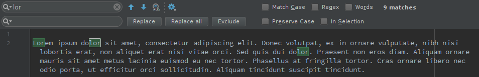

# Find & Replace Extension for Text Editing
RegEx Search & Replace Extension for Chrome and Firefox browsers.

## Project Specification

### Principal Goal

Develop a Chrome/Firefox browser plug-in to allow Search & Replace with regular expressions in text input fields of web pages.  

### Description

The project will develop a Chrome browser plug-in that would provide a search & replace functionality in text input fields of web pages. An important part of the project is to provide support for the use of popular regular expression constructs, a functionality which is missing in extensions available today. Other desirable features include:

- Ability to restrict search & replace to the current input field (i.e. where the cursor is) or run through all input fields on the page.
- Restrict search & replace to the selected text only
- Support for templates (i.e. a small "library" of commonly occurring patterns to search-and-replace with one click).

In addition to the software development work, it is expected that the student will do at least one round (ideally two) of user testing, collecting the feedback, and improving the tool based on the responses & bug reports. An ideal way to do this is by having a stable beta version of the plugin available on the Chrome Web Store well before the thesis is due. 

## Motivation ~ Why would this be useful?

- Weird Characters In Blog Entries – This sometimes happens in WordPress immediately after an upgrade. You may end with weird characters such as “””, “’” or “??”. Imagine the agony of having to replace each occurrence manually.
- Renaming A Word – Sometimes you may want to rename a word that occurs several times in an entire blog post, forum post or email. For example, you could decide to use a synonym which sounds better or brings out the meaning more clearly.
- Fixing A Typo – You may also realize that you have been spelling a word the wrong way and it happens to reoccur several times in your blog post, forum post or email.

Search and replace would be extremely useful on these websites: WordPress, Gmail, Hotmail, Blogger, Facebook, any forums, online blogging platforms, and web email clients.

You could always paste the content into your word processor, fix it and paste it back into the Chrome input field but that is a lengthy and time consuming process, and it will most likely lose all your formatting.

With more advanced features, one could also see the history of previous find & replace operations, save favourite queries and also define paste-only templates (for instance various email templates).

## What already exists?

Web browsers support standard search functionality for any text on a page but no browsers have the find & replace functionality (Google Chrome Help Forum post asking for the feature: https://productforums.google.com/forum/#!topic/chrome/Y4UORlpdYfo)

*Google Chrome browser:*

*Mozilla Firefox browser:*

There have been several attempts to implement this functionality via an extension. Most of them either don't work, are missing functionality (particularly regex), are limited to certain websites, or are unintuitive and hard to use in general. 

### Chrome
- https://chrome.google.com/webstore/detail/search-and-replace/bldchfkhmnkoimaciljpilanilmbnofo?hl=en-GB (doesn't work in many places such as Blogger, Facebook, and has many other issues) 
- https://chrome.google.com/webstore/detail/find-replace/cfjmfciolkikfodjfdmdpdmpfbjdofek?hl=en (requires copy-pasting your desired text)
- https://chrome.google.com/webstore/detail/findr/bidnaaogcagbdidehabnjfedabckhdgc (replaces raw HTML - different, undesirable functionality, and requires excessive permissions)
- https://chrome.google.com/webstore/detail/easy-replace/ojoeejfegihohnkjlfoonbnailkohkce (not working on most websites)

### Firefox
- https://addons.mozilla.org/en-US/firefox/addon/find-and-replace-for-firefox (not working for most users, and no regex)
- https://addons.mozilla.org/en-US/firefox/addon/foxreplace/ (permanent webpage text substitution - different functionality)

### Other browsers
Approximate values for current market share for desktop are (https://en.wikipedia.org/wiki/Usage_share_of_web_browsers): Chrome 55%, Safari 15%, Firefox 10%, Edge < 5%

This project will focus on Chrome and Firefox, which mostly follow the same Extension API. Safari, although widely used, has its own extension API and is in general more involved as it requires dealing with Apple's developer libraries and licenses.

## Development

### Naming and SEO
Based on the research mentioned above, these extension names already exist: 'Easy Replace', 'Search and Replace', 'FindR', 'Find Replace', 'FoxReplace'. Using any of these existing names would be bad for SEO and discoverability. At the same time, we want to clearly indicate that the extension is used for input fields and editable content rather than HTML source code.

People are likely to search for browser extensions by typing in the functionality that they need. In our case, that might look something like 'find and replace in text input fields extension'. Stating the extensions purpose in its title and description should help us do better in search results. I therefore avoided any newly-invented words and named it **Find & Replace for Text Editing**. We are not trying to trademark a new brand name, we are simply trying to match what people might search for.

### Search and Replace UI Components
- 'Find' input field
- 'Replace' input field
- **Action buttons** (see below)
  - Replace (~ pressing ENTER in 'Replace' field)
  - Replace All
  - Find next (~ pressing ENTER in 'Find' field)
  - Find previous
  - Close widget
  - Save to favourites
- **Options** (see below)
  - Match Case (Aa)
  - Use Regex (.*)
  - Whole Word (Ab|)
  - In Text Selection
- 'X of Y' or 'No Results' indicator
- Regex groups indicator (for regex search only)
- **Panel buttons** (see below)
  - Favourites
  - History
  - Templates
  - Help/Info/Feedback

To some extent, we would like to follow the current standard of find & replace toolbars. Many of these can be seen in more advanced text editors:

*Android Studio:*

*Google Docs:*

*Visual Studio Code:*

*Sublime Text 3:*

At the same time, we should not assume that regular users are familiar with regular expression or more advanced search functions. Therefore, the UI design of some of these editor widgets should only be used as an inspiration - regular users are not developers and the number of options in this extension must not feel overwhelming. 

### Accessibility

#### Keyboard
Launch the toolbar: `Ctrl+Shift+F` (`Command+Shift+F` on Mac)
Note that all `Ctrl+F`, `Ctrl+R`, and `Ctrl+Shift+R` are already predefined browser shortcuts, so we cannot use those.

Once the search widget appears:
  - Next match: `Enter` in *Find* input field
  - Previous match: `Shift+Enter` in *Find* input field
  - Replace: `Enter` in *Replace* input field
  - Replace All: `Shift+Enter` in *Replace* input field

When user jumps between occurrences we also want to keep the text in screen viewport and we therefore always check the current element position and scroll the window accordingly in case it is out of view.

#### Context Menu
User can select text on the page and, after right-clicking the selection, search for the text using the extension. This should open the extension search widget and/or replace the current 'Find' input field with the selected text.

UPDATE: The background page cannot open the pop-up(https://stackoverflow.com/questions/5544256/chrome-extensionhow-to-pragmatically-open-the-popup-window-from-background-htm). It cannot be opened programmatically - the user must click on the browser action or press the keyboard shortcut to open it. But we can inject a content script that creates a floating div in the page with a hint text suggesting the user should press the keyboard shortcut to open the find & replace widget.

### Scope of Search

#### `<input type="text">`
For a short single line of text, HTML `<input>` element is often used. There are other types of input fields (many new were added with HTML5), such as date, email, number, tel, time, and similar, but text is the standard one. https://developer.mozilla.org/en-US/docs/Web/HTML/Element/input/text

However, due to the short length (20 characters by default), this is not the kind of input that needs the find & replace functionality. The primary use case of our extension are large multi-line text areas, so this short single-line input kind can be skipped.

#### `<textarea></textarea>`
Multi-line plain-text input space. This should be a common target for find & replace. It is used by many sites to allow users compose longer pieces of text, one of them is new post creation on Reddit.  
https://developer.mozilla.org/en-US/docs/Web/HTML/Element/textarea

#### `

`
Enabling rich text formatting by allowing HTML tags inside the text area, `contenteditable` elements are used in Gmail, Facebook posts, Facebook Messenger, GitHub editor, Twitter, and many other sites. Note that `contenteditable` is a global attribute and is therefore not limited to `div` tags.  
https://developer.mozilla.org/en-US/docs/Web/HTML/Global_attributes/contenteditable

#### `contenteditable` tag inside an `<iframe></iframe>`
Blogger.com is an example of a site that isolates the main contenteditable area in an iframe. When performing find & replace we must consider the scenario where we're dealing with elements inside an `<iframe>` on the page. 

TODO: Link http://w3c.github.io/html/editing.html#user-interaction-editing

#### Other DOM
This extension isn't meant to modify (find & replace) the raw HTML text of the page's source. It is limited to finding occurrences in text areas that are modifiable by users.  
There are certainly sites that might try to avoid all the options discussed above and implement their own text editor functionality. One noteable example is Google Docs, which is using static DOM but listen to user's keyboard events to modify it internally in JavaScript. Implementing your own online text editor from scratch without using contenteditable or textareas involves a lot of work, and such editor should probably include its own find & replace functionality, which is what Google Docs do.

At this point, it seems reasonable to limit the implementation to only cover the choices discussed above and wait for the user feedback to see if there are any widely-used sites containing their own implementation of text input areas.

### User Interface for Search Widget

#### UI Design
TODO: Explain that extensions use a pop-up widget with browserAction icon

We split the UI layout to two types - simple and advanced. Because displaying all search options in one widget might feel overwhelming for regular users, there should be a way of switching the search UI to the 'advanced' state that would include regex options and helpful previews of matched regex groups etc.

TODO: explain disabling buttons to draw attention to the active input field elements (when there are no results, or no search target)

TODO: explain highlighting via inset box shadow the currently selected input area - (we always limit find & replace to current) - because user edits one textarea at a time - We want to draw focus to what text is going to be affected. If no textarea selected, select all available - for better usability (people might complain that the extension doesn't work otherwise). Or indicate that no valid input area present on the page.

##### Why not Material Design
For the general look and feel, I decided not to use Google's increasingly popular [Material Design](https://material.io/) for several reasons. First, Material Design works well when there's a lot of space and all the elements can be spread out. Unfortunately, this extension's user interface is a small widget with very limited space and many condensed compononets.

Secondly, Material Design likes to add its *ripple effect* to most interactions (such as clicking a button). I believe this looks great for actions that have large impact (e.g. navigating to a new page, or submitting a form), but for our purposes we need something less flashy, as most buttons are going to be pressed very often (Find prev/next, and Replace button) and too many effects or animations would cause too much distraction for the user.

I believe that, to a large extent, an extension (the pop-up) should feel like it is part of the browser by perhaps matching some of the UI styles. We don't want to create an extension that gives users the feeling that it completely doesn't belong because of its wild user interface and styles.

#### UI Implementation
To implement the search UI widget, we could simply create DOM for all the input components and listen to any changes as the user interacts with the UI. Unfortunately, all input components manage their own state - a better approach would be to have the search parameters state in one central place/datastore and have the UI inputs reflect this data. Therefore, we are going to use the React.js library to implement the search UI.

React has become popular in recent years - one reason is that it enforces this pattern of always reflecting the current application state in the UI. Without it, we would have to manage all the inputs separately and this could create many UI inconsistencies - incorrect update of our internal data might create a state of the application where our search parameters are set to certain values internally but display different state externally via our UI. As we're dealing with a lot of different inputs (many search parameters as well as the simple and advanced modes of the search layout), using React seems to be a wise choice.

TODO: explain React input handling (https://facebook.github.io/react/docs/forms.html) and technologies used (https://facebook.github.io/react/docs/installation.html) and my search-widget project setup + tech stack in general  
TODO: mention [component separation for easier development](./search-widget/README.md)

### API Design
There should be an extension background page with a content script that is programmatically injected into the page whenever the user triggers 'find & replace'.

TODO: Explain the reasoning behind this and how extensions work in general (https://developer.chrome.com/extensions). And also: https://developer.mozilla.org/en-US/Add-ons/WebExtensions/Anatomy_of_a_WebExtension#Options_pages

TODO: Explain security scopes, Chrome API being available from the background page, page content being accessible only from content scripts. 

TODO: Explain permissions set in manifest and motivation behind the `activeTab` permission https://developer.chrome.com/extensions/activeTab#motivation  (we are not requesting chrome.tabs permission)

Instead of searching for a one text occurrence at a time, we want to match the behaviour of modern text editors and show the user all matches at once using text highlighting. We therefore only perform the search once (meaning everytime search parameters change), because later actions (find next/prev, replace one/all) will simply work with the text occurrences we already found. 

#### Component Lifecycle
Our background page is only a single JavaScript file that sets up all required events and starts listening to incoming message connections. Whenever the extension icon is clicked (or the launch keyboard shortcut pressed), our UI widget pops up. The widget can be closed/destroyed by the user anytime, so it first registers itself with our background page, so that the background page can see when the message port disconnects (when the widget is closed). 

The widget needs to communicate with the content script to manage highlighting in the page. Right after the widget connects to the background page, the background page checks if the content scripts have been injected already (the widget may have been previously closed and reopened). If they have not been injected yet, it injects them. If, on the other hand, they have been injected previously, it simply sends a message to the content script to reconnect (restart its port connection). 

How does the background page check if the content scripts have been previously injected for a given tab? One solution I considered was storing tab IDs and checking a given tab ID against our stored list of IDs to decide if the content scripts are already injected in this tab. This approach might be buggy when we move tabs between more than one browser windows and is also not very efficient.

Instead, to check if our content scripts have been injected, I came up with a different approach. I created a new very simple content script, that gets injected into the page first before anything else, and simply detects the presence of the code directly in the page (it executes in the same sandboxed namespace so we can check for existence of our JavaScript variables) and returns this boolean result to the background page, which acts accordingly.

Once our main content scripts are injected, they broadcast a port connection - both the background page and UI widget are listening for this event. Background page needs to connect to the content script to see when the message port disconnects (user may have navigated to a different page and we thus lost the injected code). Search widget needs the content script connection for all its API actions - this is going to be the most frequent message passing channel.

##### Why is the lifecycle complicated
We are managing three separate component - the search widget, the background page, and the context of the webpage itself (via content scripts). None of these components are permanent - The search widget can be destroyed/closed anytime. The content scripts in the page are lost whenever the user navigates to a different website. And finally the background page isn't persistent either - it simply sets up a bunch of event listeners that can wake it up in the future, and shuts itself down.

Could we do everything in the content scripts? Content scripts run in the content of the webpage and for security reasons they don't have access to the Chrome APIs - for a large portion of the extension functionality, and for the search widget integration, we need the background page.

##### Storing State
TODO:  
In Widget - Search params, all inputs;  
In Content Script: Refs to all DOM textarea elements, Find-next number (because it keeps dynamically changing and search widget should only receive it from content script messages passed to it)
In Background: Nothing - here we just set up events

TODO: Explain chrome.storage https://developer.chrome.com/extensions/storage and describe challenges faced when syncing state within the app - abstracting with Promises and chaining async operations once finished + observer pattern - subscribing to updates when another part of the app changes storage

#### Favourites Panel
TODO: explain hashing search state to check if the item is in favourites

#### History Panel

#### Templates Panel

#### Help Panel

#### User actions
- Update search query or options
  - 'Find' input field content changes
  - One of the search options is toggled
- Find next/previous
- Replace current/all
- Close the widget
- Click one of the panel buttons
  - Show Favourites
  - Show History
  - Show Templates
  - Show Help/Info

#### Actions API
User actions specified above directly translate to types of messages that need to be passed between our widget and the content scripts in the page. We define the following API, where each message has the prototype `{ action: string, data: Object }` where `data` is optional:

**action: shutdown**
- Clean up all active highlights when widget is closed

**action: restart**
- Trigger port reconnect action, on widget re-open

**action: log**
- Logs `data`

**action: updateSearch**
- Uses `data` to update search parameters
- Returns: `{ invalidRegex: boolean, invalidSelection: boolean, searchIndex: number, searchCount: number, currentMatch: object }`

**action: findNext**
- Finds next match
- Returns: `{ searchIndex: number, searchCount: number, currentMatch: object }`

**action: findPrev**
- Find previous match
- Returns: `{ searchIndex: number, searchCount: number, currentMatch: object }`

**action: replaceCurrent**
- Replaces current match with `data` contents
- Returns: `{ searchIndex: number, searchCount: number, currentMatch: object }`

**action: replaceAll**
- Replaces all matches with `data` contents
- Returns: `{ searchIndex: number, searchCount: number, currentMatch: object }`

**action: insertTemplate**
- Inserts template text `data` at current cursor
- Returns: `{ noCursorPosition: boolean }`

Object `currentMatch` is used to display advanced regex information about matched regex groups. It has the following structure: `{ groups: Array<string>, replace: string }`

### RegEx Search
JavaScript contains native support for regular expressions (https://developer.mozilla.org/en-US/docs/Web/JavaScript/Guide/Regular_Expressions). Without using any additional libraries, we can simply create new RegExp objects and execute search methods on regular strings to find matches for the given regular expression query.

When choosing the string that we want to search in, we need to only consider the text content in our HTML nodes - finding matches in `innerHTML` would be a mistake since we need to ignore the website's source markup and only consider the text that users see.  

#### Highlighting Found Matches

##### Highlighting in `contenteditable`
Highlighting inside a `contenteditable` element should not be a problem - we can simply inject our own `span` element with our custom class into the element's DOM. Contenteditable elements are designed to contain any HTML nodes so no problem here.

For the highlighting, I'm going to use the [mark.js](https://markjs.io/) plugin. We could certainly implement the highlighting ourselves (wrapping each search occurrence in `` elements with custom styling), but there are many tricky cases that we need to handle. For instance, HTML `
John <b>Smith</b>
` matches the query `John S` but simply inserting a `` at the start and end would violate HTML rules, and instead we'd need to create two pairs of `` elements - for `John ` and another for `S` inside the `<b>` tags.

There are more tricky cases like this. Therefore, it's wiser not trying to reinvent the wheel and instead use a plugin that is actively maintained and used by many people.

##### Highlighting in `<textarea>`
Highlighting text in `<textarea>` is more tricky because it only allows plain text to be displayed inside it. Any styled markup will not render as expected. To overcome this, one must create an overlay that exactly matches the textarea element and then highlight text in this new element. Further, there are many browser-specific quirks and one must also take care of synchronizing scrolling and handling textareas that are resizable by the user. In other words, it is a lot of work.  
http://codersblock.com/blog/highlight-text-inside-a-textarea/

Fortunately, there have been a few attempts to implement this. The most successful version I found was the following jQuery plugin: https://github.com/lonekorean/highlight-within-textarea/ becase it also supports resizable textareas (other plugins I found did not).  
Even though this plugin does better than all the other plugins that exist, it still has many issues, particularly when it comes to transferring all necessary CSS styles. When I was testing it, it failed to properly align text for several textareas with particular styling. Therefore, I contributed to the development of this open-source plugin by fixing all the bugs I found and creating a pull-request on GitHub.  
https://github.com/lonekorean/highlight-within-textarea/pull/19
  - Submitted: Sep 24
  - Reviewed by the author: Sep 25
  - Review comments addressed: Sep 25
  - After 2nd review the discussion still continues, there are backward-compatibility issues and conflicting views on the design and purpose of the plugin. As I'm injecting the code dynamically I have a slightly different use case and might need to leave my forked version unmerged.

For highlighting text in the `
` mirroring our textarea, I'll use **mark.js** again. This is mostly for making things consistent and having a single unified function interface (finding and replacing the plaintext separately would also be an option, but we are using the library already so there's no need to make things more complicated).

#### RegExp Replace
In the replace input string, user can specify special symbols to refer to the found occurrence.

- `$n` - Where n is a positive integer, inserts the n-th parenthesized submatch string.
- `$0` or `$&` - Inserts the matched substring.

These are commonly used to extend find & replace functionality in advanced text editors. Inspiratio also taken from Mozilla's spec on MDN website: https://developer.mozilla.org/en-US/docs/Web/JavaScript/Reference/Global_Objects/String/replace#Specifying_a_string_as_a_parameter

### Handling iframes
TODO: explain recursive search for active element

TODO: explain the concept of my Context object - performing all dom operations (in particular jQuery functions) with respect to a specific Window and Document objects (such as window.getActiveSelection, window.scroll etc.)

### Google Analytics
In order to collect statistics on how users use our extension and how they interact with different UI elements, we are going to implement Google Analytics into our extension.

Collecting this data will require additional manifest permissions and also requires us to provide a way for the users to be able to opt-out from collecting them. This might dissuade a small percentage of potential users from installing the extension in the first place, but I believe this will only be a small percentage.

#### Implementing Google Analytics
The standard way of implementing Google Analytics is by inserting a short script into a web page, which then pulls more JavaScript code from Analytics servers, to collect user data, as well provide a developer interface to send additional tracking events.

This method will not work in Mozilla Firefox extensions due to their review policies (https://blog.mozilla.org/addons/2016/05/31/using-google-analytics-in-extensions/ - *The most popular way to do this is to inject the Google Analytics script into your codebase as if it were a web page. However, this is incompatible with our review policies. Injecting remote scripts into privileged code – or even content – is very dangerous and it’s not allowed.*).

As a workaround we need to use Google Analytics' Measurement Protocol (https://developers.google.com/analytics/devguides/collection/protocol/v1/), which is a simple API that accepts HTTP requests with analytics data. It collects data (and aggregates it for displaying dashboards and statistics via the same Analytics web interface) without relying on the Google Analytics JavaScript library running on the client, so we are essentially asked to implement the library ourselves and only send requests in the appropriate format to this API.

TODO: Explain how session is measured: https://support.google.com/analytics/answer/2731565 - 30 minute inactivity is a reasonable measure

#### General Tracking
I am going to embed the Google Analytics code into our extension's widget, so that we can track how many times users open the search widget, as well as how many unique users we have, and what kind of population they represent (along with additional user details).

##### Pageview Tracking
Our search widget is essentially a single page application, but we would like to track how many times users open different widget tabs (history, templates, etc.). So we send a `pageview` event every time a user opens a tab, and set the pageview path to the name of the tab. That way we can look at opening tabs as an actual page navigation. Suggestions taken from https://developers.google.com/analytics/devguides/collection/gtagjs/single-page-applications.

#### Event Tracking
In addition to the basic user and page view tracking we would like to know how users interact with our extension and in particular, if they use certain functionality significantly less/more. This might suggest potential ways we can improve our extension - for instance, if nobody ever uses the templates panel, perhaps we need to educate users on how to use it more effectively, or perhaps reconsider its overall usability.

##### Events
- Analytics enabled/disabled clicked - If the user has allowed Analytics to be used for a week and then opts-out, we want to know they did it (rather than thinking they stopped using the extension)
- Added to/Removed from Favourites - We can get more insight by looking at how often users use the star button. If they've never used it, perhaps it's not intuitive enough.
- New Template Created - Enables us to see how often users create new templates. If the numbers are very low, perhaps they don't know how to use this feature.
- Template Successfully Pasted - Enables us to see how many users have successfully inserted a template into a web page and thus how many know how to use them.
- Advanced Search enabled/disabled - We would like to know how often users use the advanced search functionality (regex search and in-selection search)

### Testing
How can we test our extension? The Chrome Extension Guides contain a section on debugging (https://developer.chrome.com/extensions/tut_debugging) but do not mention any extension testing methods.

For testing web applications in general we have several kinds of tests (Sources: https://medium.com/powtoon-engineering/a-complete-guide-to-testing-javascript-in-2017-a217b4cd5a2a): 
  - Unit Tests - testing individual functions
  - Integration Tests - testing several modules working together
  - Functional Tests - testing a scenario on the whole product (in-browser interaction)

#### Unit Tests
Our content script contains a lot of individual functions that we can test separately. I'm going to use [Mocha.js](https://mochajs.org/) for unit testing of the content script.

#### Integration Tests
Our UI search widget is mostly focusing on keeping the state of UI consistent. Here we are more interested in the widget being rendered correctly as a whole, rather than looking at individual HTML elements. Because of the way we separated the search widget development (described earlier), we can simply mount our React root on a standard website and use Mocha again to test basic user interaction. There will be no content script for it to communicate with, but this is not the focus at this point.

#### Functional Tests
To implement functional tests, we would need to drive a browser that installs our extension and interacts with it. There is a tool called [PhantomJS](http://phantomjs.org/) which is commonly used for headless WebKit testing. Unfortunately, it is not based on Chromium, so we cannot load Chrome extensions (https://stackoverflow.com/a/23643111).

To be able to install and test the extension as a whole in Chrome and Firefox, we are going to use [Selenium](http://www.seleniumhq.org/), which is a browser automation tool that can directly control a browser instance and allows us to install browser extensions as a part of the testing process https://stackoverflow.com/questions/15005833/browser-plugin-testing-with-selenium/17117849).

We are going to install Selenium WebDriver to control Chrome and Firefox browsers. The Selenium WebDriver accepts commands via a client API and sends them to a browser (https://en.wikipedia.org/wiki/Selenium_(software)#Selenium_WebDriver). The client API has several implementations in various programming languages. I decided to use JavaScript to keep my whole codebase consistent. 

The Selenium project have their own JavaScript implementation for the client API, but after comparing it to alternatives, I decided to use [WebDriver.IO](http://webdriver.io/), which is another JavaScript implementation of the (Selenium 2.0) WebDriver API, but it has much simpler and more readable syntax (https://github.com/webdriverio/webdriverio#syntax-example).

##### Sites that need test coverage
- Gmail
- Blogger
- WordPress
- Reddit
- Stack Overflow
- Google Groups
- LinkedIn (article editor)
- (currently broken) Facebook (+Messenger), Quora

### Sites currently known to be broken
- Facebook - highlighting and replace works but is reverted to original onClick
- Quora - completely broken - inserting `<mark>` violates their `` format and scatters original text (inserts newlines)

#### Why is it broken
TODO: Explain Issues: - Facebook uses contenteditables and keeps the text content in JavaScript variables (separately). When I insert my markup, and replace text, their JavaScript immediately restores the previous state (switches back to the orginal text). When I detach their JavaScript listeners by cloning the contenteditable DOM node, I'm able to highlight and replace text successfully and the user can continue editing, but when they click the post button, all changes made after the last search & replace operation are lost because the text that is posted is the content of their JavaScript variables, not the actual contenteditable content.

Quora does the exact same thing. 

#### How to fix broken sites:
There would need to be an alternative way of adding/changing the editable text (besides directly changing textContent/innerHTML/innerText). Sending keyboard events does not seem to work.

1. Help sought on Stack Overflow: https://stackoverflow.com/questions/46981226/edit-text-in-facebook-messenger-contenteditable-div?noredirect=1#comment80915743_46981226
2. Marked as off-topic - but someone commented with a possible hint in time
	- Potential fix: *Focus the editor element and use document.execCommand in 'insertText' or 'insertHTML' mode.*
3. Discovered `document.execCommand()` API https://developer.mozilla.org/en-US/docs/Web/API/Document/execCommand

#### Product Development Iteration with `document.execCommand()`
TODO: Explain the API, that it originated from IE, but now is part of W3C spec (+add link)

After switching to `execCommand` for manipulating `contenteditable` suddenly insertion started working on Facebook:
- It fixed template insertion in Facebook contenteditable

However, for replacement (where the original content must be deleted first) it proved very unreliable, because `execCommand` operates on the active cursor selection, which can be programmatically set by manipulating the `Selection` object, but since there's no way to tell it to select only the text content itself it ended up deleting whole DOM tags and even after a lot of testing it wasn't reliably able to replace parts of text in a post and pass through all the automatic DOM manipulation that Facebook implements. Therefore, we disable the extension on Facebook and Messenger for now.

LinkedIn: All inserted content and tags are filtered so we cannot insert `<mark>`s or ``s. We check which tags are allowed - `
`, `<strong>`, `<em>`, `<u>`, so we can use the underline (`<u>`) instead of `<mark>`. Solved.

Quora: It doesn't allow us to insert marks or any formatting as all inserted content is immediately filtered. The only tag which is not filtered out is `
` and Quora uses a complicated hierarchy with various class name swapping on new text insertion. This is very tricky if not impossible to fix. When users try to use the extension on Quora, simply let them know that it does not work there.

### Distribution & Marketing
TODO: Video demo idea: Open GMail, insert a 'template' and search and replace {NAME} with an actual name

### Feedback & Iteration
User interaction testing challenge: 1) Perform a find and replace 2nd and 3rd occurrence, but only match case 2) Page refresh and perform that again but this time replace all occurrences, knowing the extension has a history tab 3) Now send me feedback - must find link in extension's help panel (promise not to read feedback until later)

#### Support website
TODO: explain Firebase hosting: https://firebase.google.com/docs/hosting/

TODO: explain Firebase functions: https://firebase.google.com/docs/functions/write-firebase-functions

There are various ways we could collect feedback. We could have a website that provides a contact email address or asks users for a feedback message and sends an email automatically. This email inbox could get very cluttered and hard to manage, especially since we want to collect various forms of feedback (e.g. did user just uninstall the extension, or are they happy and simply want to propose new features?). 

I decided to go with an alternative solution - we store all submitted feedback messages in a database. This database can be later queried and filters based on various criteria (time of submission, feedback type, ...).

### More ideas/TODOs
- Look at structure of previous dissertation projects
- Find a good Markdown to Latex converter
- Use we or I in text
