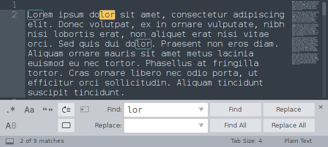

# Search-And-Replace
RegEx Search & Replace Extension for Chrome and Firefox browsers

## Project Specification

### Principal Goal

Develop a Chrome/Firefox browser plug-in to allow Search & Replace with regular expressions in text input fields of web pages.  

### Description

The project will develop a Chrome browser plug-in that would provide a search & replace functionality in text input fields of web pages. An important part of the project is to provide support for the use of popular regular expression constructs, a functionality which is missing in extensions available today. Other desirable features include:

- Ability to restrict search & replace to the current input field (i.e. where the cursor is) or run through all input fields on the page.
- Restrict search & replace to the selected text only
- Support for templates (i.e. a small "library" of commonly occurring patterns to search-and-replace with one click).

In addition to the software development work, it is expected that the student will do at least one round (ideally two) of user testing, collecting the feedback, and improving the tool based on the responses & bug reports. An ideal way to do this is by having a stable beta version of the plugin available on the Chrome Web Store well before the thesis is due. 

## Motivation ~ Why would this be useful?

- Weird Characters In Blog Entries – This sometimes happens in WordPress immediately after an upgrade. You may end with weird characters such as “””, “’” or “??”. Imagine the agony of having to replace each occurrence manually.
- Renaming A Word – Sometimes you may want to rename a word that occurs several times in an entire blog post, forum post or email. For example, you could decide to use a synonym which sounds better or brings out the meaning more clearly.
- Fixing A Typo – You may also realize that you have been spelling a word the wrong way and it happens to reoccur several times in your blog post, forum post or email.

Search and replace would be extremely useful on these websites: WordPress, Gmail, Hotmail, Blogger, Facebook, any forums, online blogging platforms, and web email clients.

You could always paste the content into your word processor, fix it and paste it back into the Chrome input field but that is a lengthy and time consuming process.

## What already exists?

Web browsers support standard search functionality for any text on a page but no browsers have the search & replace functionality (Google Chrome Help Forum post asking for the feature: https://productforums.google.com/forum/#!topic/chrome/Y4UORlpdYfo)

*Google Chrome browser:*

*Mozilla Firefox browser:*

There have been several attempts to implement this functionality via an extension. Most of them either don't work, are missing functionality (particularly regex), are limited to certain websites, or are unintuitive and hard to use in general. 

### Chrome
- https://chrome.google.com/webstore/detail/search-and-replace/bldchfkhmnkoimaciljpilanilmbnofo?hl=en-GB (doesn't work in many places such as Blogger, Facebook, and has many other issues) 
- https://chrome.google.com/webstore/detail/find-replace/cfjmfciolkikfodjfdmdpdmpfbjdofek?hl=en (requires copy-pasting your desired text)
- https://chrome.google.com/webstore/detail/findr/bidnaaogcagbdidehabnjfedabckhdgc (replaces raw HTML - different, undesirable functionality)
- https://chrome.google.com/webstore/detail/easy-replace/ojoeejfegihohnkjlfoonbnailkohkce (not working on most websites)

### Firefox
- https://addons.mozilla.org/en-US/firefox/addon/find-and-replace-for-firefox (not working for most users, and no regex)
- https://addons.mozilla.org/en-US/firefox/addon/foxreplace/ (permanent webpage text substitution - different functionality)

### Other browsers
Approximate values for current market share for desktop are (https://en.wikipedia.org/wiki/Usage_share_of_web_browsers): Chrome 55%, Safari 15%, Firefox 10%, Edge < 5%

This project will focus on Chrome and Firefox, which mostly follow the same Extension API. Safari, although widely used, has its own extension API and is in general more involved as it requires dealing with Apple's developer libraries and licenses.

## Development

### API Design
There should be an extension background page with a content script that is programmatically injected into the page whenever the user triggers 'search & replace'.

TODO: Explain the reasoning behind this and how extensions work in general (https://developer.chrome.com/extensions).

TODO: Explain security scopes, Chrome API being available from the background page, page content being accessible only from via content scripts. 

TODO: Define message passing API between the background page and content scripts.

TODO: Explain permissions set in manifest and motivation behind the `activeTab` permission https://developer.chrome.com/extensions/activeTab#motivation

### Search and Replace UI Components
- 'Find' input field
- 'Replace' input field
- **Action buttons** (see below)
  - Replace (~ pressing ENTER in 'Replace' field)
  - Replace All
  - Find (~ pressing ENTER in 'Find' field) OR Next match (+ Previous match)
  - Close
- **Options** (see below)
  - Match Case (Aa)
  - Use Regex (.*)
  - Whole Word (Ab|)
  - In Text Selection
  - In Current Input Field
- 'X of Y' or 'No Results' indicator
- Regex groups indicator (for regex search only)
- Common Substitution Templates

In general we would like to follow the current standard of search & replace toolbars. Many of these can be seen in more advanced text editors:

*Android Studio:*

*Google Docs:*

*Visual Studio Code:*

*Sublime Text 3:*

At the same time, we should not assume that regular users are familiar with regular expression or more advanced search functions. Therefore, the UI design of some of these editor widgets should only be used as an inspiration - regular users are not developers and the number of options in this extension must not feel overwhelming. 

### Accessibility

#### Keyboard
Launch the toolbar: `Ctrl+Shift+F` (`Command+Shift+F` on Mac)
Note that all `Ctrl+F`, `Ctrl+R`, and `Ctrl+Shift+R` are already predefined browser shortcuts, so we cannot use those.

Once the popup appears:
  - Next match: `F3` or `Enter` in 'Find' input field
  - Previous match: `Shift+F3`
  - Replace: `Enter` in 'Replace' input field
  - Replace All: `Ctrl+Shift+A`

#### Context Menu
User can select text on the page and, after right-clicking the selection, search for the text using the extension. This will open the extension popup and/or replace the current 'Find' input field with the selected text.

### Scope of Search

#### `<input type="text">`
For a short single line of text, HTML `<input>` element is often used. However, due to the short length, this will mostly not be a common target of search & replace. Still, it should be included for consistency.

There are other types of input fields (many new were added with HTML5), such as date, email, number, tel, time, and similar, but text is the standard one.

#### `<textarea></textarea>`
Multi-line plain-text input space. This should be a common target for search & replace. It is used by many sites to allow users compose longer pieces of text, one of them is new post creation on Reddit.

#### `

`
Enabling rich text formatting by allowing HTML tags inside the text area, `contenteditable` elements are used in Gmail, Facebook posts, Facebook Messenger, GitHub editor, Twitter, and many other sites. Note that `contenteditable` is a global attribute and is therefore not limited to `div` tags.

#### `contenteditable` tag inside an `<iframe></iframe>`
Blogger.com is an example of a site that isolates the main contenteditable area in an iframe. When performing search & replace we must consider the scenario where we're dealing with elements inside an `<iframe>` on the page. 

#### Other DOM
This extension isn't meant to modify (search & replace) the raw HTML text of the page's source. It is limited to finding occurrences in text areas that are modifiable by users.  
There are certainly sites that might try to avoid all the options discussed above and implement their own text editor functionality. One noteable example is Google Docs, which is using static DOM but listen to user's keyboard events to modify it internally in JavaScript. Implementing your own online text editor from scratch without using contenteditable or textareas involves a lot of work, and such editor should probably include its own search & replace functionality, which is what Google Docs do.

At this point, it seems reasonable to limit the implementation to only cover the choices discussed above and wait for the user feedback to see if there are any widely-used sites containing their own implementation of text input areas.

